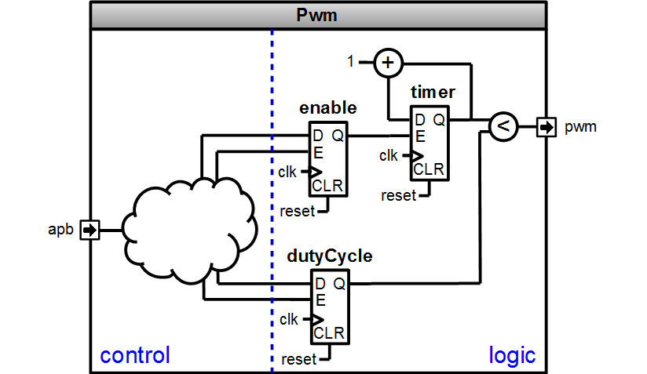
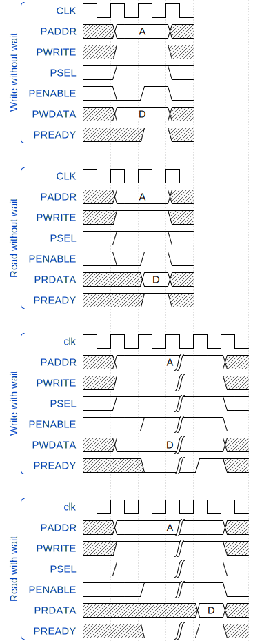

## Introduction
To goal of this lab is to get a little bit more into SpinalHDL by understanding how you can organise things. 
The Component to implement is an PWM generator which is controllable mapped on a APB bus.

This lab will introduce :
- Data structure and  buses (Bundle)
- Conditional statments (switch)
- Functionality groups (Area)

There is diagram of the component to implement : 

There is a wave from the logic part : 

## Component interfaces

| name | direction | type | description |
| ------ | ----------- | ------ | ------ |
| apb | slave | APB | Bus used to read and write internal registers |
| pwm | out | Bool | PWM output of the component |

## Register mapping

| name | type | address |  description |
| ------ | ------ | ----------- | ------ |
| enable | R/W | 0 | Enable the internal timer when the register LSB is set |
| dutyCycle | R/W | 4 | Specify how many cycles the `pwm` output is high in a timer period.   Range from 0 to (1 << timerWidth)-1 |

## RTL parametrization

| name | type | description |
| ------ | ----------- | ------ |
| apbConfig | ApbConfig | Specify the shape of the APB bus |
| timerWidth | Int | Specify how many bits has the internal timer |

## APB specification
The APB bus is a very simple (and also old, but still used) peripheral bus. It is specified by ARM, there are its signals :  

| Signal name | type |  driver | description |
| ------ | ----------- | ------ | ------ |
| PSEL | Bits(selwidth bits) | Master | Select which slave should listen the bus (One hot) |
| PENABLE | Bool | Master | True when a transaction is on the bus |
| PWRITE | Bool | Master | True when the transaction is a Write, else it's a read |
| PADDR | UInt(addressWidth bits) | Master | Address of the transaction in byte |
| PWDATA |  Bits(dataWidth bits)  | Master | Data used for write transactions |
| PRDATA |  Bits(dataWidth bits)  | Slave | Data used for read transactions |
| PREADY | Bool | Slave | Allow the slave to insert wait cycles durring a transaction |

Note : For this labs, you don't need to insert wait cycle on the bus, so you can keep the PREADY always high. Also we will assume that we are the slave ID 0, which mean that PSEL(0) is True when the transaction is destinated to our PWM component.

there is some typical chronograms : 

 
