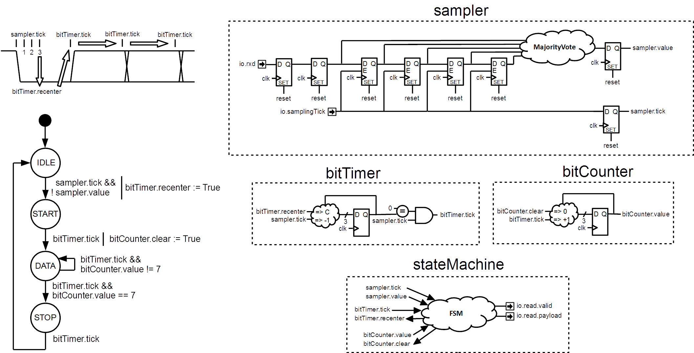

## Description
The goal of this lab is to implement a component that receive UART frames and translate them into a flow of bytes. (RS232 => UART)

The UART is an old transmission protocol which transmit data in serial with a fixed asynchronous baudrate.

In this labs, the configuration of the UART transmission will be 8 bits of data per frame, no parity and 1 stop bit.

This configuration will produce the following chronogram : 
Note : Start and Stop bauds allow the receiver to detect frames. 

Because the UART transmission is asynchronous, the receiver need to filter its input. This will be done by using a sliding window of samples with an majority vote to establish the value of the `RDX` line.
This window will only care about `samplingSize` samples in the center of each baud, and will not care about `preSamplingSize` samples at the beginning and `postSamplingSize` at the end of each baud.

This lab will introduce :

- State machines
- valid-payload protocol (Flow)
- Some utilse of the SpinalLib (History, MajorityVote)

## Component interfaces

| name | direction | type | description |
| ------ | ----------- | ------ | ------ |
| rxd | in | Bool | Pin used to receive UART frames |
| samplingTick | in | Bool | Time reference used to sample `rxd`   Tick `preSamplingSize + samplingSize + postSamplingSize` time per uart baud  |
| read | master | Flow(Bits(8 bits)) | Flow used to transmit decoded bytes |

## RTL parametrization

All RTL parameters are contained into the `UartRxGenerics` class. This class contains following parameters :

| name | type | description |
| ------ | ----------- | ------ |
| preSamplingSize | Int | Specify how many samplingTick are drop at the beginning of a UART baud |
| samplingSize | Int | Specify how many samplingTick are used to sample `rxd` values in the middle of the UART baud  |
| postSamplingSize | Int | Specify how many samplingTick are drop at the end of a UART baud  |

## RTL diagram

This Component is divided in 4 Area :

- sampler : Which implement the UART baud filter
- bitTimer : Which could be configured by the FSM to provide a tick on each end of UART baud.
- bitCounter : Which is a simple clearable counter.
- stateMachine : Which manage all this stuff together.

There is some explanation diagrams :  

