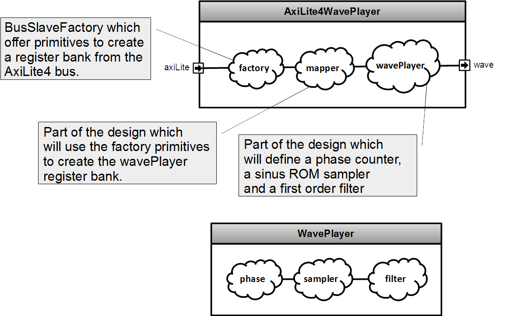

## Introduction
To goal of this lab is to have more practice with Area and BusSlaveFactory. Especialy to get a better understand about how you can define Area as a proper class and reuse it later.

The component to implement is an wave generator with an preloaded sinus wave. This component will also have an AxiLite4 interface to access its registers.



## Component generics

| name | type | description |
| ------ | ----------- | ------ |
| sampleWidth       | Int | Bit count of the ROM and the wave output |
| sampleCountLog2   | Int | ROM address's bit count |
| phaseWidth        | Int | Number of bits used for the phase counter (bigger than sampleCountLog2) |
| filterCoefWidth   | Int | Number of bits used by the first order filter's coefficient |

## Component interfaces

| name | direction | type | description |
| ------ | ----------- | ------ | ------ |
| axiLite | slave | AxiLite4 | Bus used to access the component's registers |
| wave | out | UInt(sampleWidth bits) | Wave output |

## Register mapping

| name | type | address |  description |
| ------ | ------ | ----------- | ------ |
| wavePlayer.phase.run     | Bool                       | R/W | 0x00 | When set, the `phase` value will increment by `rate` each cycle|
| wavePlayer.phase.rate    | UInt(phaseWidth bits)      | W   | 0x04 | Value that should be added the the phase value each cycle when run is enable |
| wavePlayer.phase.value   | UInt(phaseWidth bits)      | R   | 0x08 | Phase value |
| wavePlayer.filter.bypass | Bool                       | R/W | 0x10 | When set, the filter output value is directly set from the rom sampler value |
| wavePlayer.filter.coef   | UInt(filterCoefWidth bits) | W   | 0x14 | First order filter coefficient, formated as an unsigned fixed point Q0.filterCoefWidth |

## Sampler

There is multiples syntaxes to define a ROM in SpinalHDL, on of them is :

```scala
val romSamples = for(sampleId <- 0 until sampleCount) yield{
  BigInt(sampleId*sampleId)
}
//Will define a rom of 16 words : (0, 1, 4, 9, 16, 25 , ...)
val rom = Mem(UInt(8 bits), 16) initBigInt(romSamples)
```

BigInt in scala represent an Int with an adaptative bitcount.

For this lab, you will need to use Math.sin, Math.PI and Math.pow in order to calculate the rom samples. The sinus wave should be centred on (1 << sampleWidth-1), the peak to peak amplitude should be (1 << sampleWidth) - 1.

You can read the rom by using its readAsync function.


Note, there is another syntax to define ROM where you can use SpinalHDL literals like U"001010".

## Filter

The filter internal accumulator should be updated each cycle by the following way :

```scala
nextValue = currentValue - currentValue * coef + sampler.sample * coef
```

Note, the above example make the assumption that the coef arithmetic is an unsigned fixed point Q0.filterCoefWidth.

